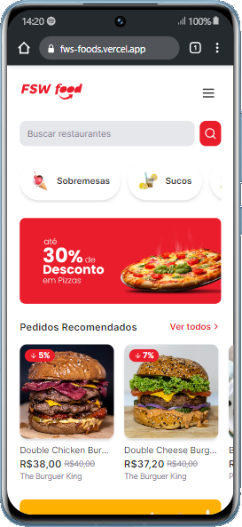
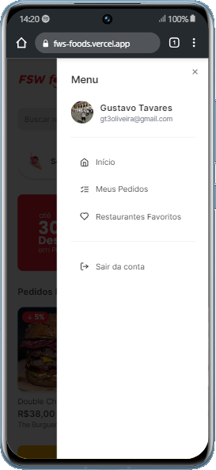
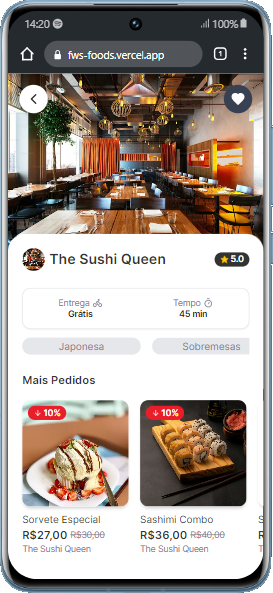
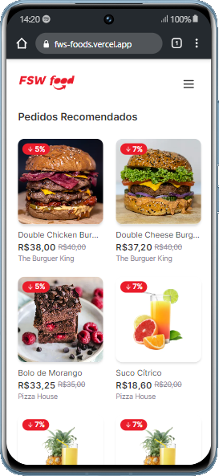
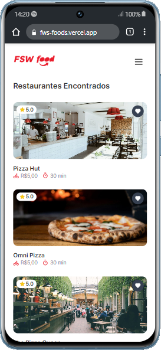
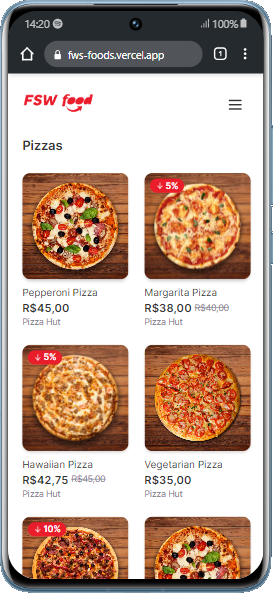
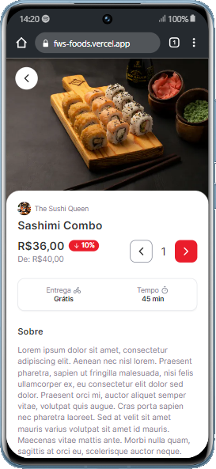
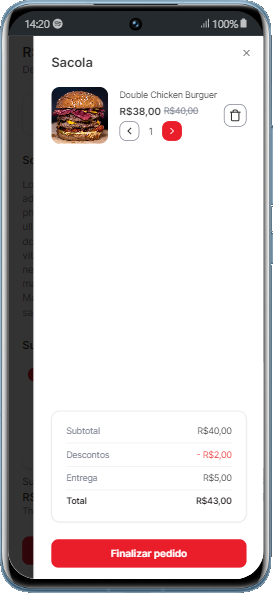
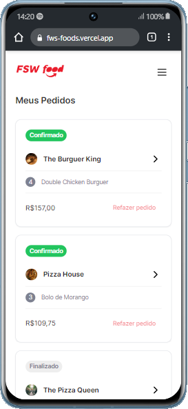

Este é um projeto [Next.js](https://nextjs.org/) iniciado com [`create-next-app`](https://github.com/vercel/next.js/tree/canary/packages/create-next-app).

## 👨🏻‍💻 Começando...

Primeiro, execute o servidor de desenvolvimento:

```bash
npm run dev
```

Abra [http://localhost:3000](http://localhost:3000) com seu navegador para ver o projeto.

## 👀 Saiba Mais...

Dê uma olhada nas seguintes tecnologias utilizadas no projeto:

✔ [Next Auth](https://next-auth.js.org/getting-started/example) - clique e conheça mais sobre essa solução completa de autenticação de código aberto para aplicativos Next.js.

✔ [shadcn/ui](https://ui.shadcn.com/docs) - Componentes projetados que você pode copiar e colar em seus aplicativos. Acessível. Customizável. Código aberto.


✔ [Prisma](https://www.prisma.io/docs/getting-started) - É um ORM Node.js e TypeScript de última geração que abre um novo nível de experiência do desenvolvedor ao trabalhar com bancos de dados graças ao seu modelo de dados intuitivo, migrações automatizadas, segurança de tipo e preenchimento automático.

✔ [Tailwind](https://tailwindcss.com/docs/installation) - Verifica todos os seus arquivos HTML, componentes JavaScript e quaisquer outros modelos em busca de nomes de classes, gerando os estilos correspondentes e depois gravando-os em um arquivo CSS estático.

## 📱 Layouts do projeto

- Home e menu do usuário

<div style="display: inline">
  &nbsp;&nbsp;&nbsp;&nbsp;
  &nbsp;&nbsp;&nbsp;&nbsp;
</div>

##
- Restaurante, restaurantes recomendados e a busca de restaurante

<div style="display: inline">
  &nbsp;&nbsp;&nbsp;&nbsp;
  &nbsp;&nbsp;&nbsp;&nbsp;
  &nbsp;&nbsp;&nbsp;&nbsp;
</div>

##
- Categorias (pizzas, burgers, sobremesas...)
<div style="display: inline">
  &nbsp;&nbsp;&nbsp;&nbsp;
</div>

##
- Produto e produtos recomendados

<div style="display: inline">
  &nbsp;&nbsp;&nbsp;&nbsp;
  &nbsp;&nbsp;&nbsp;&nbsp;  
</div>

##
- Sacola e meus pedidos
<div style="display: inline">
  &nbsp;&nbsp;&nbsp;&nbsp;
  &nbsp;&nbsp;&nbsp;&nbsp;
</div>
